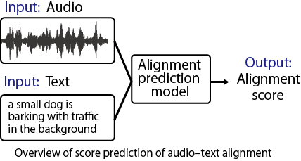

# XACLE Challenge  Benchmark Model
A benchmark model for automatic evaluation of text-audio alignment in the XACLE Challenge 2026.

## 📌 Table of Contents
- [Overview](#overview)
- [Features](#features)
- [Requirements](#requirements)
- [Installation](#installation)
- [Project Structure](#project-structure)
- [Usage](#usage)
- [License](#license)
- [Citation](#citation)

<h2 id="overview">📖 Overview</h2>

This repository contains the benchmark model for automatic evaluation of text-audio alignment in the [XACLE Challenge 2026](https://xacle.org/index.html). It provides a model trained to estimate subjective evaluation scores from text-audio pairs. In the benchmark model, BYOL-A is used as the Audio Encoder and RoBERTa as the Text Encoder, and score prediction is performed using the features extracted from these encoders along with listener embeddings. <br>We sincerely thank the authors for sharing the official code and facilitating the advancement of academia. <br><br>


<h2 id="features">✨ Features</h2>

- Automatically evaluates text-audio alignment scores.
- Supports BYOL-A (Audio Encoder) and RoBERTa (Text Encoder)
- Uses listener embeddings to improve prediction accuracy.
- Provides ready-to-use trained benchmark model.

<h2 id="requirements">💻 Requirements</h2>

- Python : Tested on 3.9.21
- CUDA   : Tested on 11.8 (for GPU acceleration)
- Python Packages (the core dependencies for this project are listed in requirements.txt)
    - easydict==1.13
    - librosa==0.9.2
    - matplotlib==3.5.1
    - nnAudio==0.3.3
    - numpy==1.24.1
    - pandas==1.4.1
    - pytorch-lightning==1.6.0
    - scikit-learn==1.0.2
    - SoundFile==0.10.3.post1
    - tqdm==4.66.5
    - transformers==4.15.0

<h2 id="installation">⚙️ Installation</h2>

### 1. Clone the repository
```bash
git clone https://github.com/XACLE-Challenge/XACLE_benchmark_model.git
```
```bash
cd xacle_benchmark_model
```
### 2. Create and activate a virtual environment
```bash
python -m venv xacle_env && source xacle_env/bin/activate
```

### 3. Upgrade pip
```bash
python -m pip install --upgrade "pip<24.1"
```

### 4. Install required packages
```bash
pip instal -r requirements.txt
```

### 5. Install Torch
Please install Torch and Torchaudio according to your environment. Below is an example of the version that has been confirmed to work in a CUDA 11.8 environment.
```bash
pip install torch==2.2.0+cu118 torchaudio==2.2.0+cu118 \
  --index-url https://download.pytorch.org/whl/cu118
```

### 6. Download pretrained models
hogehoge

### 7. Download datasets
hogehoge

<h2 id="project-structure">📂 Project Structure</h2>

```bash
xacle_benchmark_model/
├── README.md
├── requirements.txt
├── config.json
├── inference.py
├── train.py
├── datasets/
│   ├── xacle_benchmark_dataset.py
│   └── data/ # Need to Download
├── losses/loss_function.py
├── models/
│   ├── Byola.py
│   ├── Roberta.py
│   ├── xacle_benchmark_model.py
│   ├── byola/chkpt/AudioNTT2022-BYOLA-64x96d2048.pth   # Need to Download
│   └── chkpt_benchmark_model/best_model.pt             # Need to Download
├── pics/
└── utils/utils.py
```

<h2 id="usage">🚀 Usage</h2>

### For training
```bash
python train.py
```
### For Inference
```bash
python inference.py
```

<h2 id="license">📄 License</h2>

hogehoge

<h2 id="citation">📚 Citation</h2>

```bibtex
@hogehoge{xacle2026,
    title={Xacle Challenge},
    author={hogehoge},
    journal={hogehoge},
    year={hogehoge}
}
```